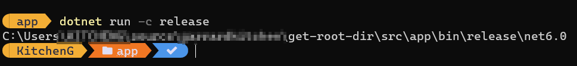
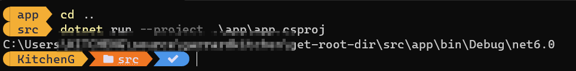
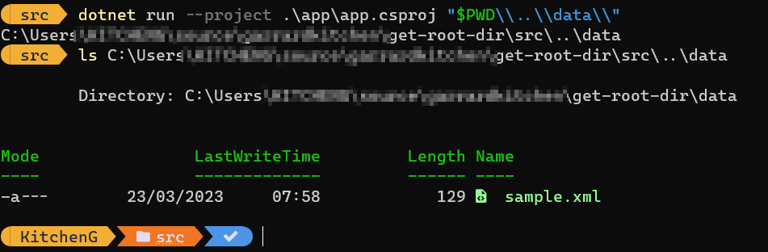

Navigate into app folder:

```
cd src\app
```

Download package dependencies:

```powershell
dotnet restore
````

build + run:

```powershell
dotnet run -c release
```

```powershell
dotnet run -c debug
```

Sample output:



cd up a level:

```powershell
cd ..
dotnet run --project .\app\app.csproj
```

Sample output:



```powershell
dotnet run --project .\app\app.csproj "$PWD\\..\\data\\"
```

Sample output:


